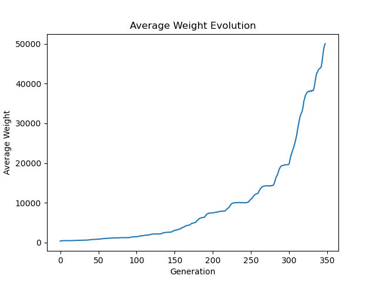

# :rat: RatEvo :rat:
RatEvo is python simulation that explores genetic algorithms by mutating rats
## Goal
The goal of this program is for entertainment purposes and to practice my python programming skills\
The program simulates mutating rats to reach a certain (gigantic) weight. Based on fitness, selection, and mutation
## Usage
If you want to try out the program\
download or clone the repository onto your machine (make sure to have python downloaded)\
and type ```python3 mutant_rats.py``` in the terminal or launch through an IDE
## Output Example

## Reference
The inspiration for this code comes from the book Impractical Python Projects by Lee Vaughan
